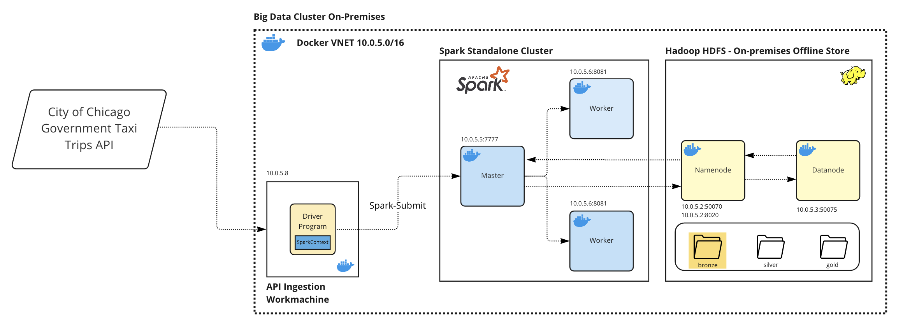
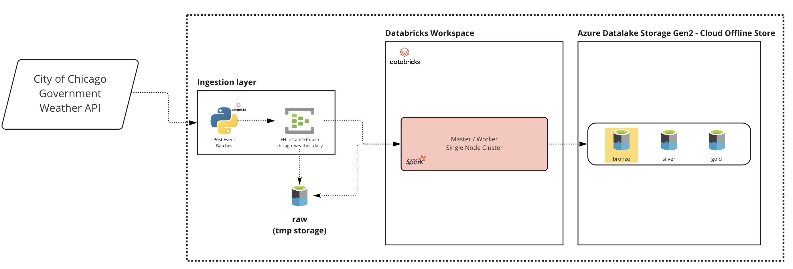

# My-Feast - Implementando uma Feature Store em um ecossistema de dados híbrido (On-Prem & Cloud)

## Overview

Este projeto é uma demostração de uso de uma feature store em uma arquitetura de dados híbrida, composta por um data lake on-premises (Hadoop/HDFS) e um data lake na cloud (Azure Data Lake Gen2).

## Conceitos e Objetivos

    'Deploying ML is hard.'

A máxima acima, talvez exagerada (ou nem tanto), é o principal motivo da exisência das Feature Stores. Em resumo, uma `feature store` é um sistema responsável por gerir, "armazenar" e servir dados, preprocessados, para modelos de ML. 

Em um pipeline, ou ciclo de vida, de um modelo, os processos de Feature Engineering e produtização das features criadas demandam tempo e possuem grande complexidade; um cientista de dados atuando na criação de um conjunto de entidades e suas variáveis, não é capaz de, rapidamente e com autonomia, publicar suas features para treino e serving destes dados aos modelos de ML.

Uma feature store soluciona este problema, ao atuar como uma camada única de acesso aos dados, desacoplando o storage das features da recuperação destas. Em essência, uma feature store complementa o ecossistema de dados existente, ao fornecer uma camada de `gestão de metadados` das features que permite a `Descoberta`, `Compartilhamento` e `Reuso` de fetures em uma organização, além de servir dados de maneira `Consistente no tempo (point in time correctness data)`, evitando a ocorrência de desvios entre os dados de treino e serving do modelo (`Training-Serving skew`) e facilitando o processo de `Deploy de novas features.`


Neste projeto foi criada uma arquitetura híbrida, contando com um cluster [Spark Standalone](https://spark.apache.org/docs/latest/spark-standalone.html) e um [HDFS](https://hadoop.apache.org/docs/r1.2.1/hdfs_design.html), ambos dockerizados e um lake na cloud, utilizando como Storage o [Azure Data Lake Gen2](https://docs.microsoft.com/en-us/azure/storage/blobs/data-lake-storage-introduction) e como engine de processamento e consumo analítico, a plataforma [Azure Databricks](https://docs.microsoft.com/en-us/azure/databricks/scenarios/what-is-azure-databricks). A feature store utilizada neste projeto é o [Feast](https://docs.feast.dev/v/v0.20-branch/), um projeto Open Source, agnóstico em relação à infraestrutura.

### Disclaimer - O que não é uma Feature Store

Sim, eu sei, aqui vai mais um disclaimer 😐. Apesar do cliché, é importante delimitar o que uma feature store `não é`:

* `Feature Store não é um Sistema de ETL/ELT`. A Feature Store não é (e não pretende ser) um sistema *all purpose* para transformação ou de pipeline de dados. A Feature Store deve ser integrada aos pipelines de transformação de dados *upstream* . 
* `Feature Store não é um catálogo de dados`. A feature store não é um sistema especializado na catalogação e descoberta *all purpose* para os dados de uma organização. A feature store busca catalogar features utilizadas em modelos de ML, dentro do escopo de facilitar o reuse destas features.
* `Feature Store não é um Data Warehouse`. De fato, a feature store é uma camada *light-weight* capaz de gerenciar metadados e servir features, inclusive utilizando como fonte DWs existentes.

### Conceitos de Feature Store 
* Project: Top Level Namespace em uma Feature Store. Cada projeto, provê um isolamento completo das features à nível de infraestrutura; cada projeto deve ser entendido como um contexto inteiramente isolado de features, exemplos, `dev`, `staging`, `production`.
* Feature View: Usuários definem features views; Uma feature view consiste de um Data Source e de uma relação entre Entidades -> Features. 
  * Data Source: Fonte dos dados "brutos", subjacente.
  * Entidades: Coleções de features que são semanticamente relacionadas. 
    * Name: Nome da Entidade
    * Join Keys: Identificação das chaves primárias físicas
  * Feature Views: O Modelo de dados de uma feature store é baseado em séries temporais. Uma feature view é um agrupamento de features, que podem ser encontrados em um mesmo data source e relacionadas à(s) mesma(s) entidade(s).


  
* Offline Store: Armazenam dados históricos das séries temporais utilizados pelas features; podem ser Data Lakes, Data Warehouses etc (ex: HDFS, ADLS, Snowflake, Synapse, Redshift, etc).
* Online Store: Armazenam vetores para *serving* das features em baixa latência. São utilizados para realizar *feature lookups* online.
* Registry: Repositório central de metadados; armazena a definição das features e todos os metadados relacionados. O feature registry é utilizado na descoberta e recuperação das features.     

O diagrama a seguir apresenta a arquitetura genérica de uma feature store.


# Arquitetura e Funciamento do Projeto

O uso de uma feature store é escalável quando este componente integra a arquitetura / infraestrutura do ecossistema de dados preexistente. Por este motivo, o uso de um sistema *light-weight*, que é capaz de utilizar o *compute* e o *storage* existentes, sem modificações no ambiente, é vantajoso. O Feast é um SDK que conta com poucas (em alguns casos, possivelmente nenhuma) modificação na infraestrutura existente. O único novo componente adicionado na feature store é o Feature Registry; atualmente são utilizados *buckets* ou *object stores* para armazenamento dos metadados das features. A arquitetura deste case, demonstra a adição de uma feature store à arquitetura de dados existente de uma grande organização. 

O ecossistema de dados apresentado nesta demo, conta, previamente (simulado, a infra on-prem e na cloud foi profisionada para execução do case), com um cluster de Big Data on-prem com os seguintes componentes: Um Cluster Hadoop com um HDFS (1 Namenode e 1 Datanode - **não foi provisionado um secondary namenode, por simplicidade**) e um cluster Spark Standalone (1 master e 2 worker nodes); na cloud, este ambiente é composto de uma Storage Account com Hierarchical Namespace habilitado (Azure Data Lake Store Gen2), Workspace Databricks e um Azure Event Hub workspace. Os componentes de infraestrutura adicionados nesta infra (considera-se que são componentes não existentes na infra anterior) foram, uma Storage Account (Blob Storage), utlizada como camada de armazenamento dos arquivos do Feature Registry, e um Azure Cache for Redis, utilizado como Online Store para serving de feature vectors.

O diagrama abaixo apresenta a arquitetura descrita acima, bem como o fluxo de dados e metadados neste projeto.


## Ingestão de dados

Neste projeto foi realizado um processo de ingestão de dados simplificado, com a finalidade de demonstrar a ingestão de dados estruturados a partir de APIs abertas governamentais. Foi feita a ingestão de dois datasets a partir das APIs de domínio público do [governo da cidade de chicago](https://data.cityofchicago.org/). 

### Taxi Trip API

Esta API contem dados referentes às viagens de taxi na cidade de Chicago, detalhes quanto ao modelo de dados desta api podem ser consultados [aqui](https://data.cityofchicago.org/Transportation/Taxi-Trips/wrvz-psew). Os dados são recuperados a partir da SODA API do dataset wrvz-psew. Pra realizar a ingestão dos dados, foi criado um script de ingestão que pode ser encontrado [aqui](https://github.com/danielfaioli/my-feast/blob/master/infra/on-prem/ingest_scripts/ingest_taxy.py). O processo de ingestão pode ser iniciado subindo o cluster utilizando o [docker-compose](https://github.com/danielfaioli/my-feast/blob/master/infra/on-prem/docker-compose.yaml) presente no repositório. Para facilitar o provisionamente do cluster e o start do processo de ingestão, foi criado o seguinte [Makefile](https://github.com/danielfaioli/my-feast/blob/master/infra/on-prem/Makefile). Para realizar uma ingestão rode os seguintes comandos:

⚠️ **WARNING** - Se você não buildou as imagens do cluster spark, execute primeiro:

```shell
$ make build
```

1. Inicie o cluster 

```shell
$ make cluster
```

2. Inicie o processo de Ingestão 

```shell
$ make ingestion
```

⚠️ **WARNING** - Altere o service `workmachine` no docker-compose com o Ano/Mês que deseja realizar a ingestão. 

O processo que será executado realizará uma chamada na SODA API do dataset, realizará a paginação das requests, recuperando os registros do dataset. Em seguida, os registros são convertidos em um Dataset Spark (RDD), utilizando, por default 31 partições (aproximadamente o número de dias em um mês - isso é feito para controlar a distribuição de dados entre as partições e ao mesmo tempo evitar stages excessivamente grandes, isto é maiores que 1000KB, no job Spark). O rdd é então convertido em Spark DataFrame, reparticionado utilizando o campo `created`, referente ao data de criação do dado e é feito á carga no Data Lake (HDFS), na camada Bronze. O dado `não é transformado neste processo`, sendo carregado com o seguinte schema:
```text
ingestion_dataframe (pyspark.sql.DataFrame)
  - created: String
  - Body: String
```
O Campo `Body` é uma string contendo todo o conteúdo do registro, com a mesma formatação da origem.



### Weather API

Esta API contem dados referentes às leituras de tempo na cidade de Chicago, detalhes quanto ao modelo de dados desta api podem ser consultados [aqui](https://data.cityofchicago.org/Parks-Recreation/Beach-Weather-Stations-Automated-Sensors/k7hf-8y75). Os dados são recuperados a partir da SODA API do dataset k7hf-8y75. O script que realiza a coleta dos dados da API e a publicação das mensagens para o tópico no Event Hub, pode ser encontrado [aqui](https://github.com/danielfaioli/my-feast/blob/develop/infra/cloud/fs-cloud/ingest_weather_chicago.py). À fim de replicar este processo, você irá precisar dos seguintes recursos:

1. Azure Tenant & Subscription
2. Resource Group
3. Storage Account com Hierarchical Namespace habilitado
4. Databricks Workspace (dica: use o trial de 14 dias)
5. Service Principal (para autenticação entre a sessão Spark no Databricks e a Storage Account)
6. Event Hub Workspace (Standard ou Premium - um workspace básico não possui suporte para captura de Eventos)

O processo executado no script de ingestão, consiste de uma consulta à [API](https://data.cityofchicago.org/Parks-Recreation/Beach-Weather-Stations-Automated-Sensors/k7hf-8y75) para buscar dados diários das leturas climatológicas, é feito o controle da paginação da API e a criação de event batches para envio asíncrono ao Event Hub. O Event Hub workspace está configurado para capturar as mensagens postadas no tópico `chicago_weather_daily`; foi setado um buffer para captura das mensagens em intervalos de 3 minutos, de maneira a agregar as mensagens recebidas dentro desta janela em um único arquivo [avro](https://en.wikipedia.org/wiki/Apache_Avro). A ingestão destes dados para o Data Lake (na camada bronze), é realizada pelo script que pode ser encontrado [aqui](https://github.com/danielfaioli/my-feast/blob/master/infra/cloud/fs-cloud/chicago_weather_bronze.py). Assim como na ingestão no on-prem, os dados brutos não são transformados nesse step, faz-se a inclusão do metadado de criação do dataset (`created` field). O corpo das mensgens (`Body`), são armazenados na camada bronze, garantindo sua consistência com os dados da origem; é feita a padronização de formato (delta - parquet + metadados).



## Feature Engineering and Register

O processo de Feature Engineering pode ser definido como a utilização do conhecimento semântico dos dados para extração de variáveis (features) a partir de dados "brutos" (o conceito de dado bruto aqui, difere da origem dos dados mas, de fato, está relacionado a utilização de dados granulares, sem transformações, ou inclusão de regras que possam inserir viés nos dados).

Os scripts de geração da camada `SILVER` para on on-prem e para cloud, podem ser encontrados [aqui](https://github.com/danielfaioli/my-feast/blob/master/infra/on-prem/workspace-dev/fs-hadoop/chicago_taxi_trips_silver.ipynb) e [aqui](https://github.com/danielfaioli/my-feast/blob/master/infra/cloud/fs-cloud/chicago_weather_silver.py) respectivamente. 

Dentro da perspectiva de modelagem do Data Lake, a tabela contendo as features é um dado com selo Gold e, portanto, será armazenado na camada `Gold`, tanto no Lake On-prem quanto no Lake na cloud. 

O processo de extração de features dos dados da camada Silver, consistem, neste case, basicamente na transformação e agregação dos dados, pré-processados na camada silver, para geração de features. Os scripts para geração das features `fv_chi_station_reads_hourly (cloud)` e `fv_chi_taxi_trips_hourly (on-prem)` podem ser encontrados [aqui](https://github.com/danielfaioli/my-feast/blob/master/infra/cloud/fs-cloud/chicago_weather_hourly_fs.py) e [aqui](https://github.com/danielfaioli/my-feast/blob/develop/infra/on-prem/workspace-dev/fs-hadoop/chicago_taxi_trips_hourly_gold.ipynb), respectivamente.

Após a criação dos dados, físicos, das features, é preciso realizar a definição e registro das features.

### fv_chi_station_reads_hourly

Para definição da feature `fv_chi_station_reads_hourly`, cujos dados físicos foram gerados no Data Lake na Cloug (ADLS), como apresentado na seção anterior, deve se primeiro, configurar o `Feature Repository`; esta configuração define os tipos de cada Store (Offline & Online) e o location do `Feature Registry`. 

A config abaixo se encontra [aqui](https://github.com/danielfaioli/my-feast/blob/master/infra/cloud/fs-cloud/station_reads_hourly_fs/feature_store.yaml)

```yml
# file path: infra/cloud/fs-cloud/station_reads_hourly_fs/feature_store.yaml
registry:
  registry_store_type: feast_azure_provider.registry_store.AzBlobRegistryStore
  path: "https://myfeastregistry.blob.core.windows.net/feast/registry.db"
project: datamaster_teste
provider: local
online_store:
    type: redis
    connection_string: "myfeastonline.redis.cache.windows.net:6379,password=<password>"
offline_store:
    type: spark # will use the active SparkSession
```