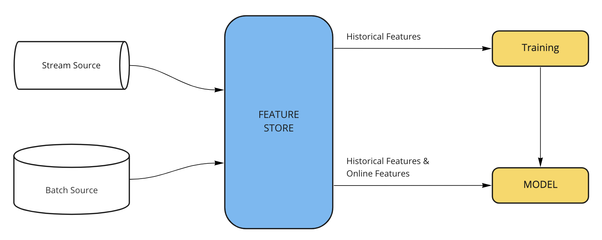
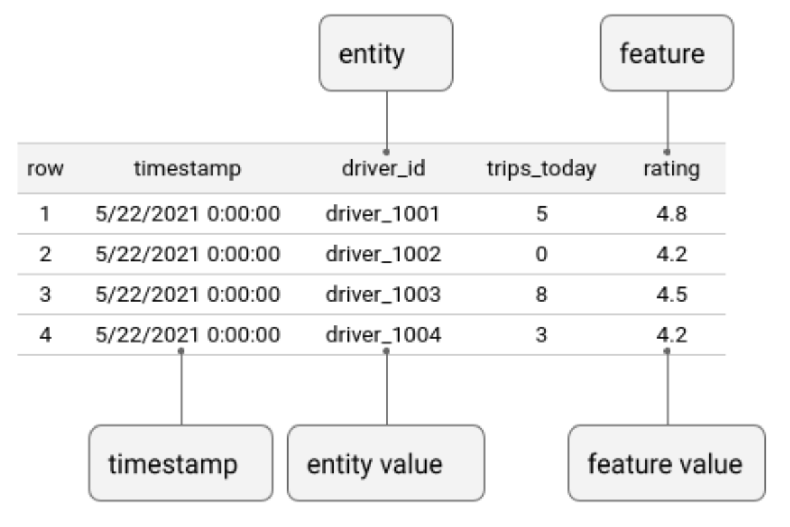
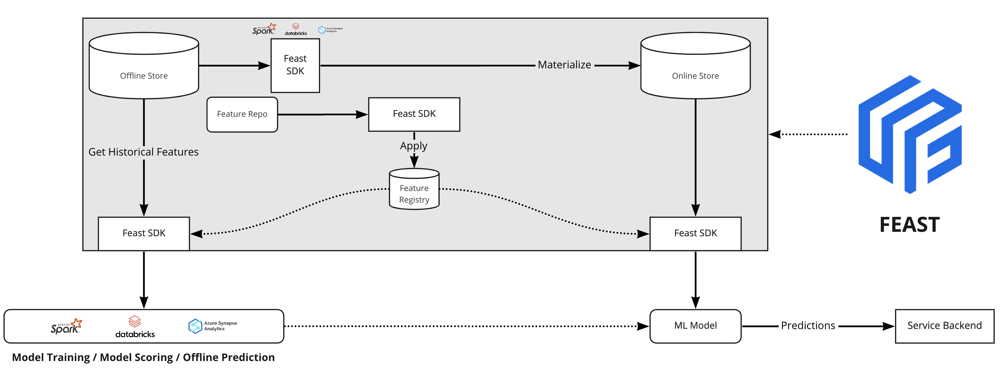
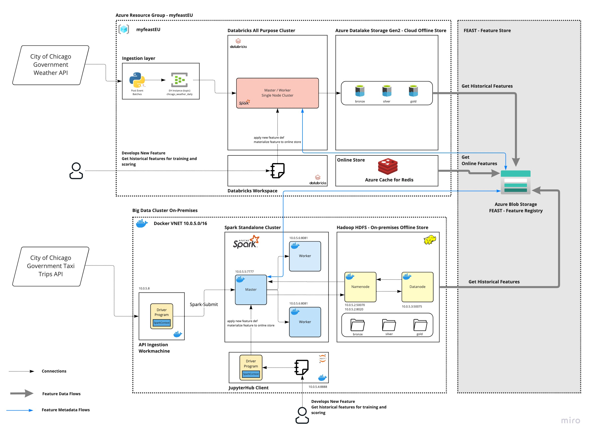

# My-Feast - Implementando uma Feature Store em um ecossistema de dados híbrido (On-Prem & Cloud)

## Overview

Este projeto é uma demostração de uso de uma feature store em uma arquitetura de dados híbrida, composta por um data lake on-premises (Hadoop/HDFS) e um data lake na cloud (Azure Data Lake Gen2).

## Conceitos e Objetivos

    'Deploying ML is hard.'

A máxima acima, talvez exagerada (ou nem tanto), é o principal motivo da exisência das Feature Stores. Em resumo, uma `feature store` é um sistema responsável por gerir, "armazenar" e servir dados, preprocessados, para modelos de ML. 

Em um pipeline, ou ciclo de vida, de um modelo, os processos de Feature Engineering e produtização das features criadas demandam tempo e possuem grande complexidade; um cientista de dados atuando na criação de um conjunto de entidades e suas variáveis, não é capaz de, rapidamente e com autonomia, publicar suas features para treino e serving destes dados aos modelos de ML.

Uma feature store soluciona este problema, ao atuar como uma camada única de acesso aos dados, desacoplando o storage das features da recuperação destas. Em essência, uma feature store complementa o ecossistema de dados existente, ao fornecer uma camada de `gestão de metadados` das features que permite a `Descoberta`, `Compartilhamento` e `Reuso` de fetures em uma organização, além de servir dados de maneira `Consistente no tempo (point in time correctness data)`, evitando a ocorrência de desvios entre os dados de treino e serving do modelo (`Training-Serving skew`) e facilitando o processo de `Deploy de novas features.`

Neste projeto foi criada uma arquitetura híbrida, contando com um cluster [Spark Standalone](https://spark.apache.org/docs/latest/spark-standalone.html) e um [HDFS](https://hadoop.apache.org/docs/r1.2.1/hdfs_design.html), ambos dockerizados e um lake na cloud, utilizando como Storage o [Azure Data Lake Gen2](https://docs.microsoft.com/en-us/azure/storage/blobs/data-lake-storage-introduction) e como engine de processamento e consumo analítico, a plataforma [Azure Databricks](https://docs.microsoft.com/en-us/azure/databricks/scenarios/what-is-azure-databricks). A feature store utilizada neste projeto é o [Feast](https://docs.feast.dev/v/v0.20-branch/), um projeto Open Source, agnóstico em relação à infraestrutura.

### Disclaimer - O que não é uma Feature Store

Sim, eu sei, aqui vai mais um disclaimer 😐. Apesar do cliché, é importante delimitar o que uma feature store `não é`:

* `Feature Store não é um Sistema de ETL/ELT`. A Feature Store não é (e não pretende ser) um sistema *all purpose* para transformação ou de pipeline de dados. A Feature Store deve ser integrada aos pipelines de transformação de dados *upstream* . 
* `Feature Store não é um catálogo de dados`. A feature store não é um sistema especializado na catalogação e descoberta *all purpose* para os dados de uma organização. A feature store busca catalogar features utilizadas em modelos de ML, dentro do escopo de facilitar o reuse destas features.
* `Feature Store não é um Data Warehouse`. De fato, a feature store é uma camada *light-weight* capaz de gerenciar metadados e servir features, inclusive utilizando como fonte DWs existentes.

### Conceitos de Feature Store 
* Project: Top Level Namespace em uma Feature Store. Cada projeto, provê um isolamento completo das features à nível de infraestrutura; cada projeto deve ser entendido como um contexto inteiramente isolado de features, exemplos, `dev`, `staging`, `production`.
* Feature View: Usuários definem features views; Uma feature view consiste de um Data Source e de uma relação entre Entidades -> Features. 
  * Data Source: Fonte dos dados "brutos", subjacente.
  * Entidades: Coleções de features que são semanticamente relacionadas. 
    * Name: Nome da Entidade
    * Join Keys: Identificação das chaves primárias físicas
  * Feature Views: O Modelo de dados de uma feature store é baseado em séries temporais. Uma feature view é um agrupamento de features, que podem ser encontrados em um mesmo data source e relacionadas à(s) mesma(s) entidade(s).

  
* Offline Store: Armazenam dados históricos das séries temporais utilizados pelas features; podem ser Data Lakes, Data Warehouses etc (ex: HDFS, ADLS, Snowflake, Synapse, Redshift, etc).
* Online Store: Armazenam vetores para *serving* das features em baixa latência. São utilizados para realizar *feature lookups* online.
* Registry: Repositório central de metadados; armazena a definição das features e todos os metadados relacionados. O feature registry é utilizado na descoberta e recuperação das features.     

O diagrama a seguir apresenta a arquitetura genérica de uma feature store.

# Arquitetura e Funciamento do Projeto

O uso feature store é escalável quando este componente integra a arquitetura / infraestrutura do ecossistema de dados preexistente. Por este motivo, o uso de um sistema *light-weight*, que é capaz de utilizar o *compute* e o *storage* existentes, sem modificações no ambiente, é vantajoso. O Feast é um SDK que conta com poucas (em alguns casos, possivelmente nenhuma) modificação na infraestrutura existente. O único novo componente adicionado na feature store é o Feature Registry; atualmente são utilizados *buckets* ou *object stores* para armazenamento dos metadados das features. A arquitetura deste case, demonstra a adição de uma feature store à arquitetura de dados existente de uma grande organização. 

O ecossistema de dados apresentado nesta demo, conta, previamente (simulado, a infra on-prem e na cloud foi profisionada para execução do case), com um cluster de Big Data on-prem com os seguintes componentes: Um Cluster Hadoop com um HDFS (1 Namenode e 1 Datanode - **não foi provisionado um secondary namenode, por simplicidade**) e um cluster Spark Standalone (1 master e 2 worker nodes); na cloud, este ambiente é composto de uma Storage Account com Hierarchical Namespace habilitado (Azure Data Lake Store Gen2), Workspace Databricks e um Azure Event Hub workspace. Os componentes de infraestrutura adicionados nesta infra (considera-se que são componentes não existentes na infra anterior) foram, uma Storage Account (Blob Storage), utlizada como camada de armazenamento dos arquivos do Feature Registry, e um Azure Cache for Redis, utilizado como Online Store para serving de feature vectors.

O diagrama abaixo apresenta a arquitetura descrita acima, bem como o fluxo de dados e metadados neste projeto.

